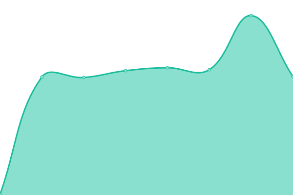

# [📈 Live Status](https://bamsemoms.github.io/Status): <!--live status--> **🟧 Partial outage**

<!--start: status pages-->
<!-- This summary is generated by Upptime (https://github.com/upptime/upptime) -->
<!-- Do not edit this manually, your changes will be overwritten -->
<!-- prettier-ignore -->
| URL | Status | History | Response Time | Uptime |
| --- | ------ | ------- | ------------- | ------ |
|  [SpillNode - Nettside](https://SpillNode.github.io/) | 🟩 Up | [spill-node-nettside.yml](https://github.com/BamseMoms/Status/commits/HEAD/history/spill-node-nettside.yml) | 

 140ms
     
 | 

<a href="https://BamseMoms.github.io/Status/history/spill-node-nettside">100.00%</a>
    

|  [SpillNode - KontrollPanel](https://BamseMoms.mcgo.io/) | 🟥 Down | [spill-node-kontroll-panel.yml](https://github.com/BamseMoms/Status/commits/HEAD/history/spill-node-kontroll-panel.yml) | 

 1211ms
     
 | 

<a href="https://BamseMoms.github.io/Status/history/spill-node-kontroll-panel">100.00%</a>
    

|  [Server 1](https://BamseMoms.mcgo.io/) | 🟥 Down | [server-1.yml](https://github.com/BamseMoms/Status/commits/HEAD/history/server-1.yml) | 

 316ms
     
 | 

<a href="https://BamseMoms.github.io/Status/history/server-1">100.00%</a>
    

<!--end: status pages-->
